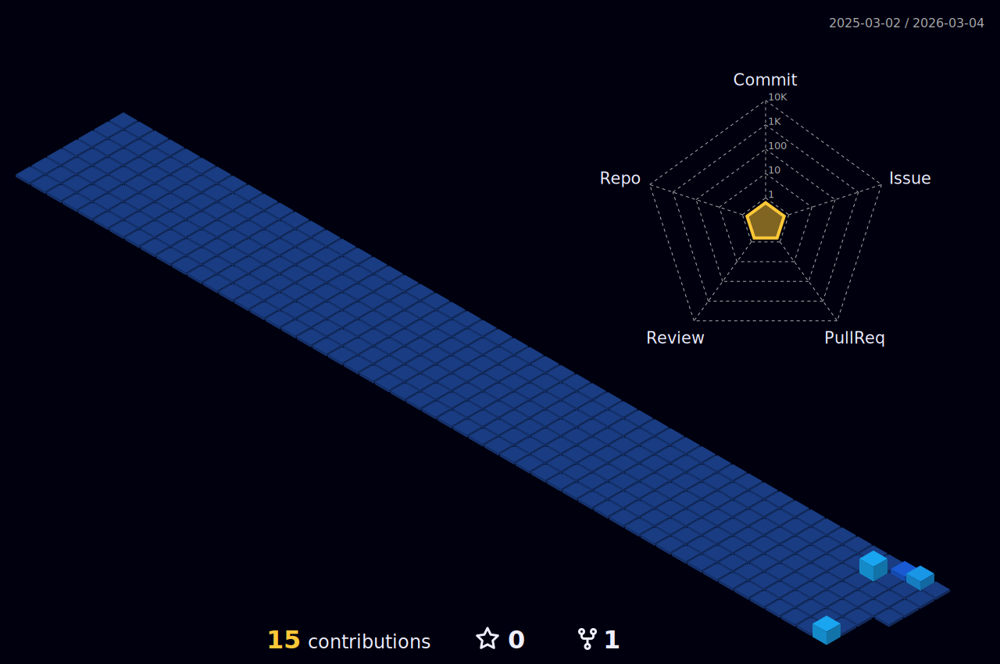

<h1 align="center">Hi 👋, I'm Boyan Yordanov</h1>
<h3 align="center">A curious programmer, who is eager to learn</h3>

> :mortar_board: Honours MSci Computer Science, Coventry University, UK.  
>
> :telescope: Programming Lead for Coventry University's **Formula Student AI Team**
>
> :seedling: Learning **Rust, AWS and Kubernetes**
>
> :page_facing_up: Interested in my experience? [Click Here!](CV/cv.pdf)
>
> :fire: Fun fact **I love Star Wars**

<h3 align="left">Skills:</h3>

---

